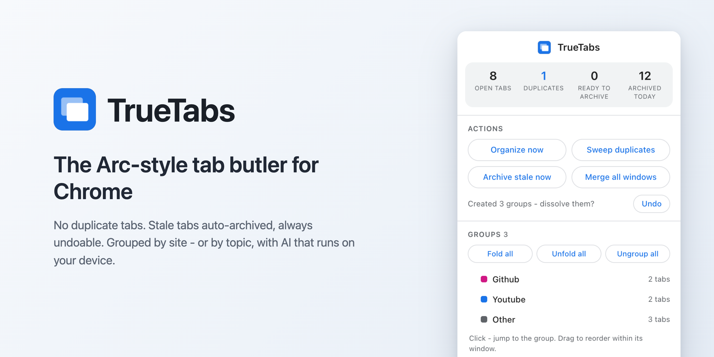

<div align="center">
  

  # TrueTabs

  **The Arc-style tab butler for Chrome.** No duplicate tabs, stale tabs
  auto-archived (always undoable), tabs grouped by site - or by topic with AI
  that runs on your device.

  
  
  
  

  <picture>
    <source media="(prefers-color-scheme: dark)" srcset="store/social-preview-dark.png" />
    
  </picture>
</div>

## Why

Live in Chrome long enough and you drown: the same page opened five times,
forty tabs you'll "read later", zero structure. Arc solved this at the
browser level - duplicates focus the existing tab, untouched tabs move to an
archive, everything stays organized. Chrome never did.

TrueTabs brings exactly that experience into Chrome's native UI. No sidebar of
its own, no new-tab page takeover - Chrome stays Chrome, the mess just stops.

## Turn on Chrome's vertical tabs. Really.

**This is the setup we recommend, and it is half the product.** Chrome can put
the tab strip down the left side:

> **Settings → Appearance → Tab position → Vertical**
>
> No such row? The rollout is gradual - open `chrome://flags/#vertical-tabs`,
> set it to **Enabled**, relaunch, and the row appears. (Verified on Chrome
> 150; `#vertical-tabs-expand-on-hover` is worth a look too.)

Why it matters here: a horizontal strip is where structure goes to die. At
forty tabs every title is gone, every group is a nameless colour chip, and the
work TrueTabs does is invisible to you. Down the side, each tab keeps its
title and each group shows its **name and colour** - so grouping stops being a
tidy-up you take on faith and becomes an outline of your day you can read.

The two halves fit exactly: Chrome renders the list, TrueTabs decides what is
in it. Duplicates never take a row. Stale tabs leave on their own. New tabs
land in the right group instead of at the end. The order you picked is kept,
so nothing jumps. That combination is the Arc sidebar - in the browser you
already use.

## What it does

| | Feature | How |
|---|---|---|
| 1 | **Duplicate prevention** | Opening a page you already have focuses the existing tab instantly - a fresh duplicate is pre-empted before it even loads. Any real page counts: websites, local `file://` pages, extension and `chrome://` pages. Re-typing an open URL into an EXISTING tab works the other way round: your tab wins, the stale copy merges into it (archived first) and the tab is re-filed by your rules. Manual "Sweep duplicates" for the pile you already have. Empty "New Tab" pages stop multiplying too: opening a new one closes the abandoned ones (never the active, pinned or grouped; a just-created blank is a page in flight and is left alone). |
| 2 | **Auto-archive** | A tab untouched for 24h (configurable 6h-7d, or off) is saved to a local archive and closed. Searchable archive page, restore in one click, notification with Undo after every batch. |
| 3 | **Auto-group** | One selector: new tabs group by *site* (stable colors, clean names) or by *topic* via AI. Idle groups collapse. One-click "Organize now" for everything else. Groups stay honest as you move on: type a new address in a grouped tab and it is re-filed instantly (your rule, the new domain's group, an existing topic, or "Other"); wander off through links and the tab is re-filed only after it settles on the foreign site for a couple of minutes - reading flows are never interrupted. Mark any of your groups protected (the lock on its popup row) and automation never takes tabs out of it. |
| 3b | **Smart groups (AI)** | Cluster tabs by *topic*, not just site - on-device Gemini Nano (free, no keys, nothing leaves your machine) or your own API key (OpenAI / Gemini / Grok / a local OpenAI-compatible server like Ollama or LM Studio). Groups appear batch by batch with live progress. With the "Other" catch-all on, nothing is left loose - new tabs that fit no topic join it. |
| 3c | **My groups (rules)** | Your named groups with routing rules: a site list (deterministic) and/or a plain-language AI hint. Rules outrank every automatic grouping. |
| 3e | **"Other" catch-all** | With it on, nothing is left loose: a tab that fits no topic, no site group and no rule parks in a grey "Other" at the end. Works with plain site grouping too - no AI required. It is a parking lot, never a decision: a real group always wins its tabs back, and the parking lot re-empties itself when you add a rule or switch modes. Hover it in the popup for a one-click **Organize** of the pile alone - by rule and by domain in any mode; with AI on it also asks the strays whether they form a topic together. |
| 3d | **Order** | Two axes: group order and tab order - Manual (you arrange them), A-Z, recently used, or oldest first. Kept live by default: new tabs slot in, manual drags snap back, and *recently used first* surfaces what you touch. Both live in the popup and in settings. Prefer it on demand? Turn "Keep the order automatically" off and the order applies only when you press Organize. |
| 4 | **Dashboard** | Live counts (tabs, duplicates, stale, archived today), one-click actions, merge all windows, master switches per automation. |

## Safety model - why you can trust automation

Everything here descends from [TruePin](https://github.com/datysho/truepin)'s
"one rule, no surprises" school:

- **Undo everything.** Every automatic archive batch has a one-click Undo
  (notification + popup). Sweep victims are archived, not lost. The archive
  keeps entries 30 days by default.
- **Two strikes and it stops.** Any automatic action you counteract twice
  (reopen a deduped page, pull a tab out of a group, expand a collapsed
  group, restore an archived tab) retires that action for that page/site
  until the browser restarts. TrueTabs never fights you - or another
  extension. The popup says when something is retired and takes it all back
  in one click.
- **Circuit breaker.** Automatic closes are capped at 25/minute; bulk
  operations declare exact budgets. Anything runaway pauses ALL automation
  for 10 minutes and tells you once.
- **Settle-then-act.** Zero automation during session restore after startup -
  a restoring session looks exactly like a duplicate storm, so the engine
  waits until the world is calm.
- **Hard no-touch list.** Pinned tabs (TruePin territory), the active tab,
  tabs playing audio, meeting sites (allowlist), your own hand-made tab
  groups - never archived, never grouped, never closed.

<details>
<summary><b>Under the hood</b></summary>

- One service worker owns all logic; popup/options/archive are thin renderers.
- Serialized mutation queue: every state change runs FIFO - no storage races.
- Archive is written BEFORE tabs close: a crash mid-batch leaves an extra
  archive row, never a lost tab.
- URL identity: normalized (host case, default ports, trailing slash, sorted
  query, tracking params like `utm_*`/`fbclid` stripped, `#/` SPA routes
  kept) - `?v=` on YouTube stays significant.
- A navigated tab is never the dedup victim: its back-history survives. On an
  address-bar/bookmark navigation the roles flip - the OTHER copy is merged
  into the tab you are in (archived first).
- Groups this extension creates are tracked by id in session storage and
  re-adopted after a restart by signature: site groups on 3-of-3 (title +
  color + member-domain majority), topic and rule groups on title + color.
  Rename or recolor a group and it is yours forever.
- Smart grouping validates model output against a strict JSON contract;
  garbage falls back to domain grouping silently. The BYOK key lives only in
  `storage.local`, is masked in diagnostics, and host access is requested at
  runtime for the one provider you chose - install-time site access is zero.
</details>

## Honest limits

- Fresh-tab dedup acts before the page loads, ahead of navigation
  classification; the one theoretical miss is a target=_blank form POST to an
  URL you already have open - its origin page stays open, and two strikes
  retire the key anyway.
- In-place merge triggers only on address-bar and bookmark navigations; link
  browsing never merges or reshuffles anything.
- The tabs API cannot see camera/microphone use - meeting sites are protected
  by an editable allowlist (meet/zoom/teams seeded) instead.
- Only websites are archived: a local or internal page cannot be recreated
  faithfully, so it is never archived and never gets an archive row - its
  duplicates are simply closed while the original stays open.
- macOS may hide notification buttons; the popup's "Undo last batch" is the
  canonical undo path.
- On-device AI needs Chrome 138+, ~22 GB free disk and 16 GB RAM or a 4 GB
  GPU; the model downloads once (~2-4 GB) and only after you click Enable.
- Smart group names come out in the dominant language of your tab titles.
- If TruePin's "move locked tabs to front" (`always` mode) is on, it may pull
  a locked tab out of a group; TrueTabs backs off after two strikes.
- Maintained sort orders only groups TrueTabs made (groups you arranged
  yourself keep their places), and the "Other" catch-all keeps the end of
  the group block.
- Link browsing re-files a grouped tab only "at rest" (a couple of minutes
  settled on the foreign site, and never while you are on the tab); typed
  and bookmark navigations re-file immediately.

### Chrome's saved tab groups (the chips) - what TrueTabs can and cannot do

Chrome can *save* a group: a chip that survives closing the group and syncs
across your devices. Extensions have **no API** for saved groups - TrueTabs
cannot see whether a group is saved, cannot unsave one, and cannot delete a
chip. Two platform facts multiply chips: groups live *per window* (each
window has its own "Other", its own "GitHub"), and saved chips sync *per
device* - save the same-named groups in three windows on two machines and
the strip shows six chips.

What TrueTabs does about it: it never mints a second live group with the
same name (a returning chip-restored copy of its own group is recognized by
signature and reused), which removes the raw material for new duplicates.

What only you can do about the chips you already have: right-click each
stale chip - **Delete group**; and if you do not want chips synced at all,
turn off "Saved tab groups" under Chrome Sync settings. Simplest of all:
do not use *Save group* on groups TrueTabs manages - it re-creates them
from signatures after every restart anyway, so the chip adds nothing.

## Install (until the Web Store listing is live)

1. Download/clone this repo.
2. `chrome://extensions` - enable Developer mode - **Load unpacked** - pick
   the `extension/` folder.

## Development

```bash
cd test
npm install
npm test           # 79 e2e contracts against a real Chrome for Testing (ONLY="substring" to run one)
HEADFUL=1 npm test
node shots.mjs     # regenerate the store screenshots
node shot-social.mjs  # regenerate the social/hero images (light + dark)
./package.sh       # build the store zip (strips the dev key)
```

## Family

TruePin protects your pinned tabs. TrueTabs runs everything else. The names
mirror the technical contract: **TrueTabs never closes, moves, groups or
archives a pinned tab** - the two coexist by construction.

- [TruePin](https://github.com/datysho/truepin) - pinned tabs that cannot be
  lost.

## Support

TrueTabs is free forever, MIT-licensed, no accounts, no telemetry. If it
saves your tabs (and your RAM), a star helps others find it. Donations - see
the heart in the popup footer once the link is live; supporters land in
[SUPPORTERS.md](SUPPORTERS.md).
